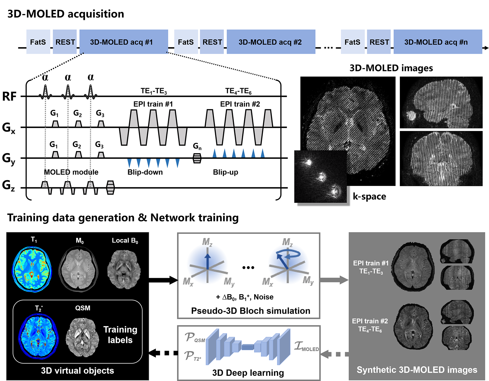
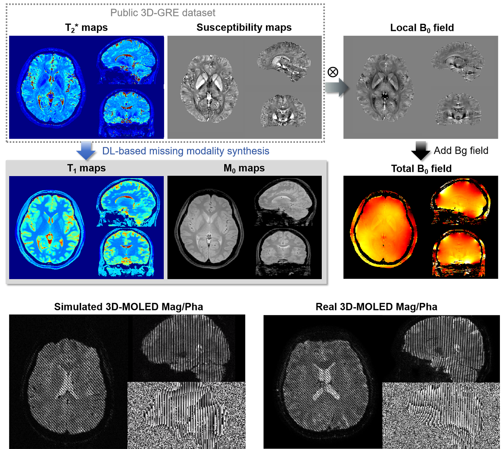

# 3D-MOLED: Rapid whole-brain T2* and susceptibility mapping using 3D multiple overlapping-echo detachment acquisition

**Contact**: Qinqin Yang (qinqin.yang@uci.edu)

## Related Paper:

Rapid whole-brain T2* and susceptibility mapping using 3D multiple overlapping-echo detachment acquisition and missing modality synthesis embedded simulation

**Status:** _Under Review at Magnetic Resonance in Medicine (MRM)

## Dependencies

**Deep Learning**: Python (version 3.9.13) and PyTorch library (version 2.1.0)

**Pre/Post-processing**: MATLAB R2024a

**FSL** version 6.0.3 (FMRIB Software Library; https://fsl.fmrib.ox.ac.uk/fsl/fslwiki/Atlases).

## Code Directory Overview

`code_t2star_QSM_process` : 3D-GRE T2star & QSM Processing — includes core processing pipelines as well as post-processing steps such as mask extraction and image registration.

`code_train_test_process` : Processing training and testing data, including DICOM data downloaded from the scanner and .out data generated by SMRI simulation

`Deep_Learning_3D_MOLED` : 3D-MOLED Parameter Mapping (Deep Learning) code based on a 3D-UNet architecture, enabling end-to-end mapping from 3D-MOLED acquisitions to T2* and QSM.

`Deep_Learning_ModSyn` : Deep learning–based modality synthesis code for virtual imaging object generation

`SMRI_for_3D_MOLED_simu` : **Compiled SMRI Platform** — specifically built for generating synthetic datasets for deep learning.  
For detailed usage and configuration instructions, please refer to the internal README.

`tools` : Required MATLAB Toolboxes and Libraries: including NIfTI reading, STISuite, image display, synthetic data reading, etc.

## Virtual Imaging Objects & Simulation Data 

